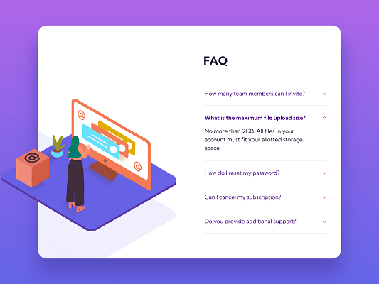

# Frontend Mentor - FAQ accordion card solution

This is a solution to the [FAQ accordion card challenge on Frontend Mentor](https://www.frontendmentor.io/challenges/faq-accordion-card-XlyjD0Oam). Frontend Mentor challenges help you improve your coding skills by building realistic projects. 

## Table of contents

- [Overview](#overview)
  - [The challenge](#the-challenge)
  - [Screenshot](#screenshot)
  - [Links](#links)
- [My process](#my-process)
  - [Built with](#built-with)
  - [What I learned](#what-i-learned)
  - [Continued development](#continued-development)
  - [Useful resources](#useful-resources)
- [Author](#author)
- [Acknowledgments](#acknowledgments)

## Overview

### The challenge

Users should be able to:

- View the optimal layout for the component depending on their device's screen size
- See hover states for all interactive elements on the page
- Hide/Show the answer to a question when the question is clicked

### Screenshot

### Links

- Solution URL: [bikeinman.github.io](https://bikeinman.github.io/fementor-02-faq/)

## My process

### Built with

- Semantic HTML5 markup
- CSS Grid
- Mobile-first workflow

### What I learned

- How to use ::after for attaching an icon to a text element
- How to use JavaScript for toggling the question
- How to center and place images in the right spots
- How to use gradients
- How to use divs to display images from css
- How to use media queries effectively to go from mobile view to destkop
- How to use grid and grid-areas

### Continued development

- Placing of stylish background images is a major problem and I think I should do more projects with images to get comfortable with complex visual elements.

## Author

- Frontend Mentor - [@BikeInMan](https://www.frontendmentor.io/profile/BikeInMan)

## Acknowledgments
All thanks to frontend mentor for providing such a great challenge.

